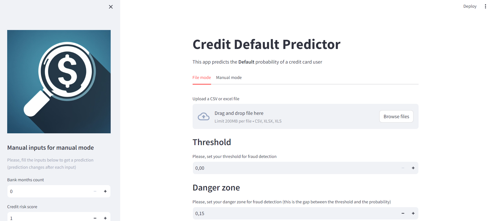
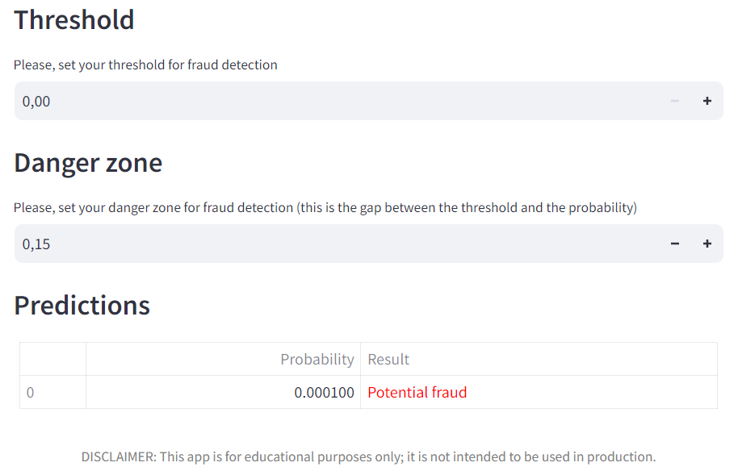
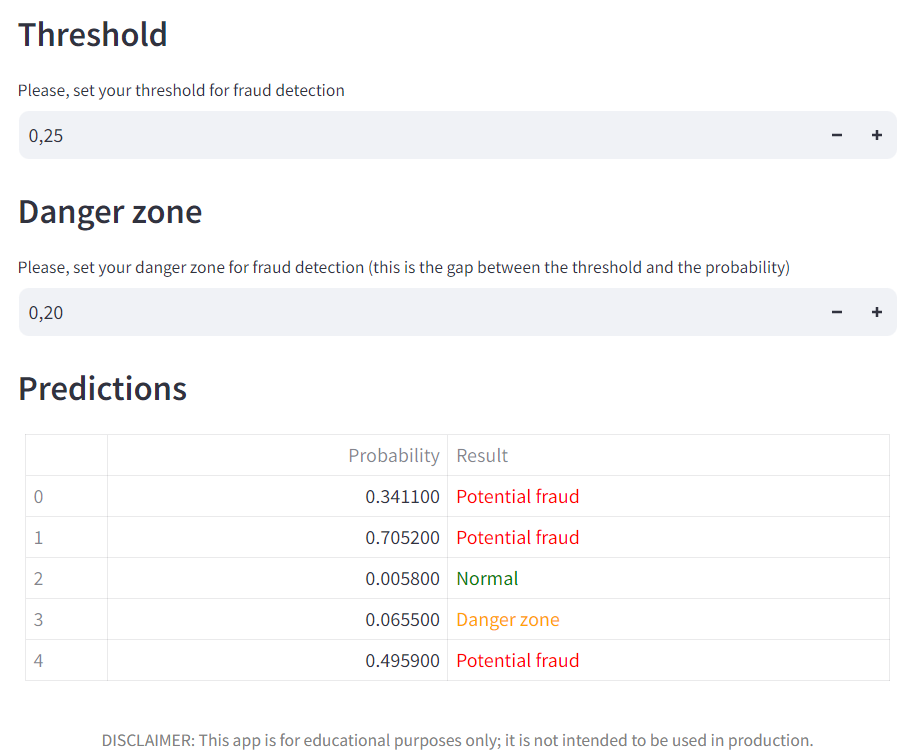
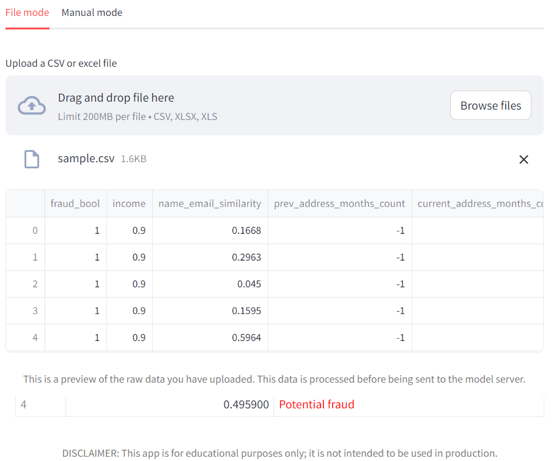
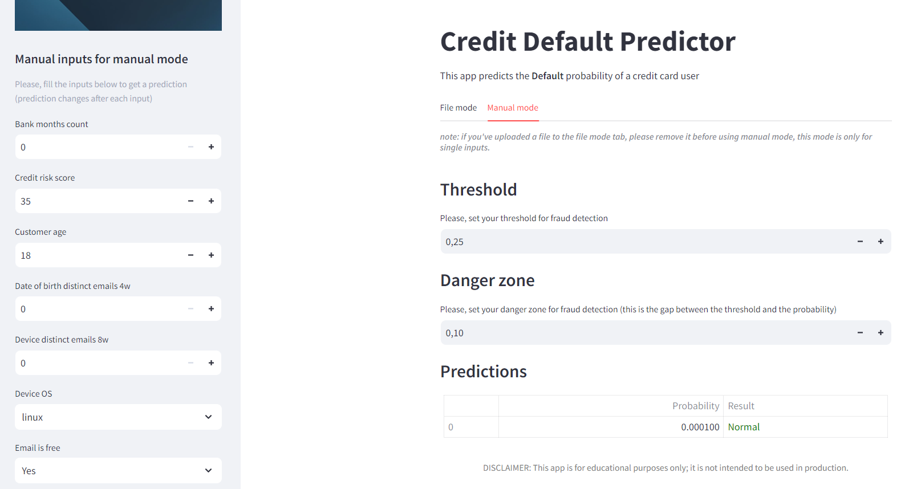

<div align="center">
    <br>
    
    <br>
    <br>
    <h1>Instrucciones Credit Default Predictor</h1>
</div>

**Autor**: Ángel Blanco García.  
**Institución**: CUNEF Universidad.  
**Programa**: Máster Universitario en Ciencia de Datos.  

## **Datos de contacto**
[<font color='orange'>Correo</font>](angel.blanco@cunef.edu)  
[<font color='lime'>Github</font>](https://github.com/angelblancog/credit_default)  
[Docker](https://hub.docker.com/u/angelbg34)

## **Índice**

1. [<font color='orange'>Acceso al dashboard</font>](#acceso-al-dashboard)
2. [<font color='orange'>Interfaz general</font>](#interfaz-general)
3. [<font color='orange'>File mode</font>](#file-mode)
4. [<font color='orange'>Manual mode</font>](#manual-mode)

## Acceso al dashboard

<div align="right">

[<font color="grey">*arriba*</font>](#índice)

</div>

1. Clonar repositorio de Github al entorno local:

   ```BASH Comando para clonar repo a local
   git clone https://github.com/angelblancog/credit_default.git
   ```

2. Acceder a la carpeta en la consola:

   ```BASH
   cd credit_default
   ```

3. Copiar el archivo .env.example a un archivo .env:

   ```BASH
   cp .env.example .env
   ```

4. Descarga de las imágenes de Docker:

   ```BASH
   docker compose pull
   ```

5. Puesta en marcha del contenedor:

   ```BASH
   docker compose up
   ```

6. Acesso a la ruta de localhost:

        en internet, acceder a la ruta que se haya puesto en el .env (por defecto: localhost:8501)

7. Interactuar con el dashboard en file mode o manual mode y seleccionando un threshold y una danger zone de detección del fraude.

        creando un archivo propio o con los ejemplos adjuntados aquí 

<div align="center">

[Google drive: archivos ejemplo](https://drive.google.com/drive/folders/16o2QeLKP6ProcPWVQxXWpiVj6fqlNUIp?usp=sharing)

</div>

<br>

- sample.csv es un archivo pequeño para probar la API con normalidad.

- junk.csv tiene una columna alterada para ver que responde correctamente a datos extraños.

- junk.xlsx es el mismo que junk.csv pero en formato excel para probar que sí funciona con archivos Excel.

<br>

## Interfaz general

<div align="right">

[<font color="grey">*arriba*</font>](#índice)

</div>

Esta es la interfaz general:

<br>

  

<br>

En ella, el usuario dispone de dos modos de uso de la API (explicados posteriormente), una zona para introducir el valor numérico del threshold de deteccción de fraude que va a utilizar, y otra para introducir el valor numérico para crear la zona de peligro. Esta última, ha sido añadida para marcar a los clientes cuya probabilidad de fraude se aproxima al threshold en el valor asignado a la danger zone.

<br>

  

<br>

En la parte inferior, aparecen las predicciones en forma de tabla. Los clientes cuya probabilidad de fraude supera el threshold asignado, aparecen marcados como <font color='red'>"Potential fraud"</font>, mientras que los que, la resta entre el threshold y a probabilidad es menor que la danger zone asignada, aparecen clasificados como <font color='orange'>"Danger zone"</font>. Por otro lado, los clientes cuya probabilidad calculada es menor al threshold y además no se encuentra en la zona de peligro, son catalogados como <font color='green'>"Normal"</font>.

### Ejemplo:

<br>

  

<br>

## File mode

<div align="right">

[<font color="grey">*arriba*</font>](#índice)

</div>

En el modo file para subir archivos, el usuario debe importar el archivo CSV o Excel para que aparezcan las predicciones en el botón de "browse files":

<br>

  

<br>

Tras haberlo hecho tendrá una preview de los datos sin procesar. Después, simplemente selecciona el Threshold y la Danger zone para ver debajo las predicciones.

## Manual mode 

<div align="right">

[<font color="grey">*arriba*</font>](#índice)

</div>

Este modo está pensado para hacer la predicción con los datos de un único cliente o probar como reacciona el modelo a cambios de valores, lo que podría ser útil en la explicabilidad del modelo.  

Para acceder a él, debe pulsarse en la tab de manual mode, ya que el modo por defecto es el file mode. 

Una vez ahí, primero selecciona el Threshold y la Danger zone, después introduce manualmente los valores en la barra lateral de la página y por último consulta los resultados en el apartado de predicciones.

><font color="red">AVISO: si previamente se ha subido un archivo, para usar el modo manual debe retirarse primero el archivo o recargar la página.</font>

<br>

  

<br>

><font color="grey">DISCLAIMER: esta app ha sido desarrollada con fines educacionales, no para usar en producción real.</font>