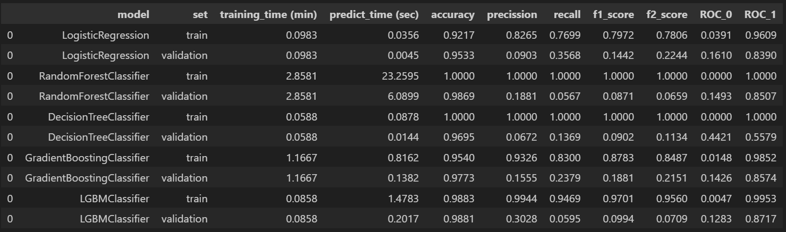
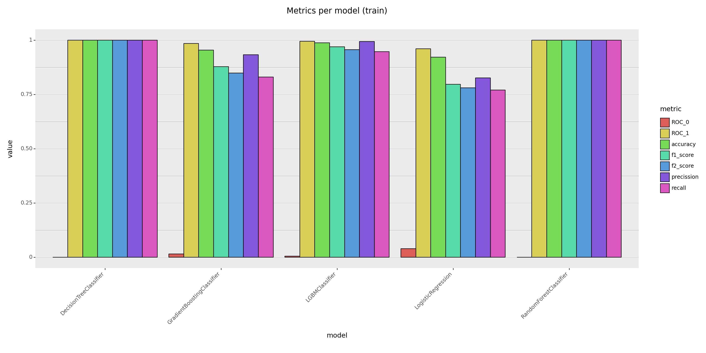
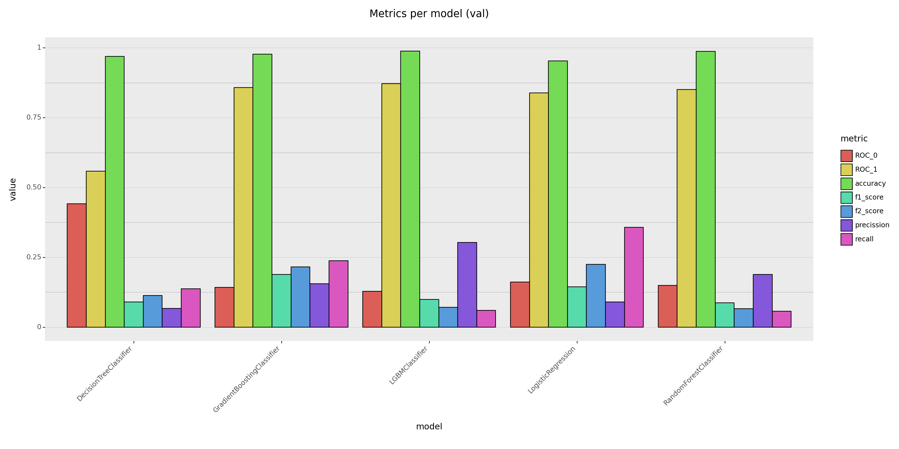

# **CONCLUSIONES DEL ANÁLISIS**

### Conclusiones del análisis de datos:
El dataset inicial constaba de 32 variables, que se han convertido en 52 tras el encoding, de las cuales se han utilizado para el modelo 35.

Como el conjunto de datos estaba desequilibrado en un 98% de casos normales y aproximadamente un 2% de casos de impago, se ha tenido que utilizar técnicas de oversampling para equilibrar las proporciones.

### Conclusiones del modelo:
Se ha optado por utilizar una Regresión Logística por su rápidez y sus resultados al compararlos con otros modelos.

No ha sido lo suficientemente bueno como para poder predecir bien la probabilidad de fraude, por lo que se deben tomar medidas para modificarlo y optar a mejores resultados. Estos fueron los siguientes:

Aciertos:
   - Para casos en los que el resultado real era de no fraude, el modelo **ha acertado en el 96% de las ocasiones** (verdaderos negativos).
   - En los casos en los que la realidad indicaba fraude, **ha acerdado el 35% de ellas** (verdaderos positivos).

Errores:
   - En las ocasiones que la realidad era fraude, **ha fallado en el 65% de ellas** (falsos negativos).
   - Y para las que eran normales, **ha fallado solamente el 4%**(falsos positivos).

Por resumirlo, el modelo es bueno prediciendo los casos de normalidad y no tanto al predecir los de alta probabilidad de impago.

### Conclusiones del problema:
La detección y predicción del fraude es una tarea compleja debido a la dificultad de detección de patrones de conductas fraudulentas o que pueden ser indicativas de que se va a comer fraude en el futuro.  

La falta de datos de casos en los que se ha cometido impago frente a la gran cantidad de datos de casos normales dificulta la acción de un modelo de Machine Learning porque aprende mucho sobre una de las clases pero es incapaz de aprender lo mismo sobre la otra, llevándolo a cometer errores en las predicciones sobre los nuevos datos.

# Anexo de métricas de los modelos:

Esta es una tabla de las métricas obtenidas en otros modelos para justificar la elección del modelo utilizado. Para ver más sobre esto: [04_baseline_models](../notebooks/04_baseline_models.ipynb)

### 
Gráfico de comportamiento de los modelos en el set de entrenamiento

### 
Gráfico de comportamiento de los modelos en el set de validación

